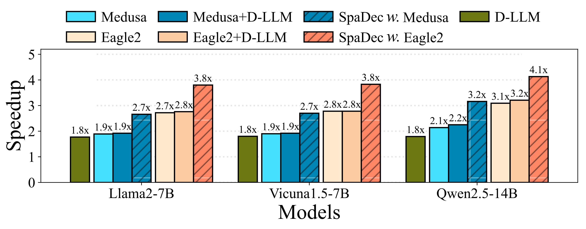
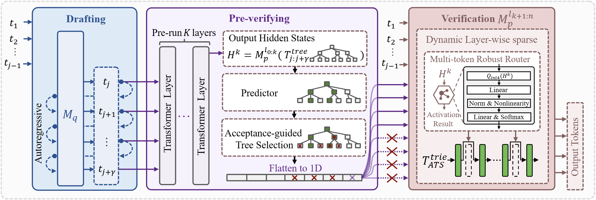
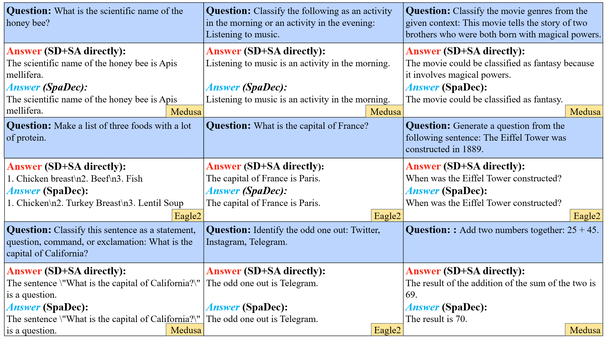

# SpaDec

## Detailed Results

### Inference Speedup

Below is the speedup ratios comparison between SpaDec and existing speculative decoding and sparsity methods.
*Medusa + D-LLM* and *Eagle2 + D-LLM* denote the direct application of D-LLM to each speculative decoding methods. *SpaDec w. Medusa* and *SpaDec w. Eagle2* represent the inference results of using *Medusa + D-LLM* and *Eagle2 + D-LLM* within our SpaDec, respectively.

<p align="center">
  
</p>

### The Overall Architecture of Our SpaDec

Here is the architecture of our SpaDec.

<p align="center">
  
</p>

### Examples of Response

Here is some examples of the token responses of the baseline methods and SpaDec to different questions. Our SpaDec attains similar response quality while demonstrating superior speed and memory efficiency.

<p align="center">
  
</p>

## Training Dataset of Predictor

We placed the training dataset for the Predictor in `/datasets/predictor/merged_data_clean_final.ckpt`

## Environment Setup

```shell
pip install torch==2.1.1 torchvision==0.16.1 torchaudio==2.1.1 --index-url https://download.pytorch.org/whl/cu118
pip install -r requirements.txt
```

## D-LLM

Refer to the README of D-LLM (D-LLM: A Token Adaptive Computing Resource Allocation Strategy for Large Language Models) for details. Key steps are listed below.

### Training

```bash
cd src/LayerSkip/D_LLM/
bash finetuning_vicuna.sh
```

### Saving the Model

1. Copy the final LoRA checkpoint to the model root directory
2. `bash vicuna/inference_vicuna.sh`
3. Organize in the format of Vicuna-7b-dllm-temp:
   1. `mv ./consolidated.00.pth /spadec/models/d-llm/Vicuna-7b-dllm-temp/`
   2. `cp /home/models/vicuna-7b-v1.5/tokenizer.model /spadec/models/d-llm/Vicuna-7b-dllm-temp/`
   3. `cp $OUTPUT_PATH$/model_args.json /spadec/models/d-llm/Vicuna-7b-dllm-temp/`
   4. `cp $OUTPUT_PATH$/params.json /spadec/models/d-llm/Vicuna-7b-dllm-temp/`

### Convert D-LLM Model to Hugging Face Format

```bash
python llama_hf/convert_llama_dllm_weights_to_hf.py \
    --input_dir /spadec/models/d-llm/Vicuna-7b-dllm-temp/ \
    --model_size 7B \
    --output_dir /spadec/models/d-llm/Vicuna-7b-dllm-temp-hf \
    --llama_version 2
# Manually delete the tmp folder
```

To adapt to the Multi-token robust router, uncomment the lines about `x = self.asymmetric_quantization_for_similarity(x, quant_bits=4)` in `src/LayerSkip/D_LLM/vicuna/model_train.py` and `src/LayerSkip/D_LLM/model.py`.

## EAGLE

Refer to the README of EAGLE (EAGLE-2: Faster Inference of Language Models with Dynamic Draft Trees) for details. Key steps are listed below.

### Generate Training Data

```bash
python -m eagle.ge_data.allocation --outdir [path of data]
```

### Train EAGLE Head

```bash
accelerate launch -m --mixed_precision=bf16 eagle.train.main --tmpdir [path of data]\
--cpdir [path of checkpoints] --configpath [path of config file]
```

Alternatively using DeepSpeed:

```bash
bash train_eagle_deepspeed.sh
```

## Evaluation

Predictor weights for the Vicuna1.5-7B model are provided in `models/predictor/Vicuna_ours_predictor/`.

In `src/SpecDecoding/EAGLE/eagle/model/ea_model.py`, set `has_predictor=False` or `True` to specify whether to use the Predictor module.

Run tests:

```bash
python test/speed_example.py --base_model_path "/path/to/base/model" --ea_model_path "/path/to/ea/model" --save_path "/path/to/save/result.json"
python test/generate_example.py --path1 result1.json --path2 result2.json
```
